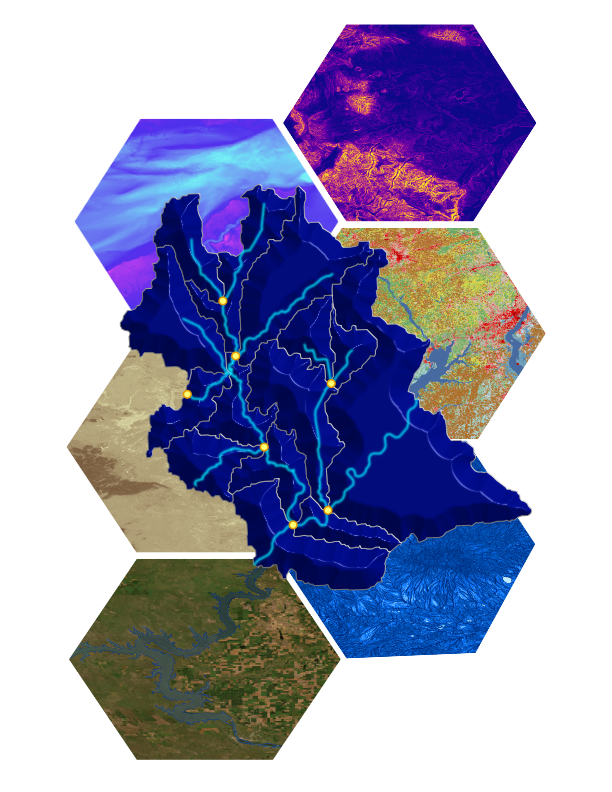
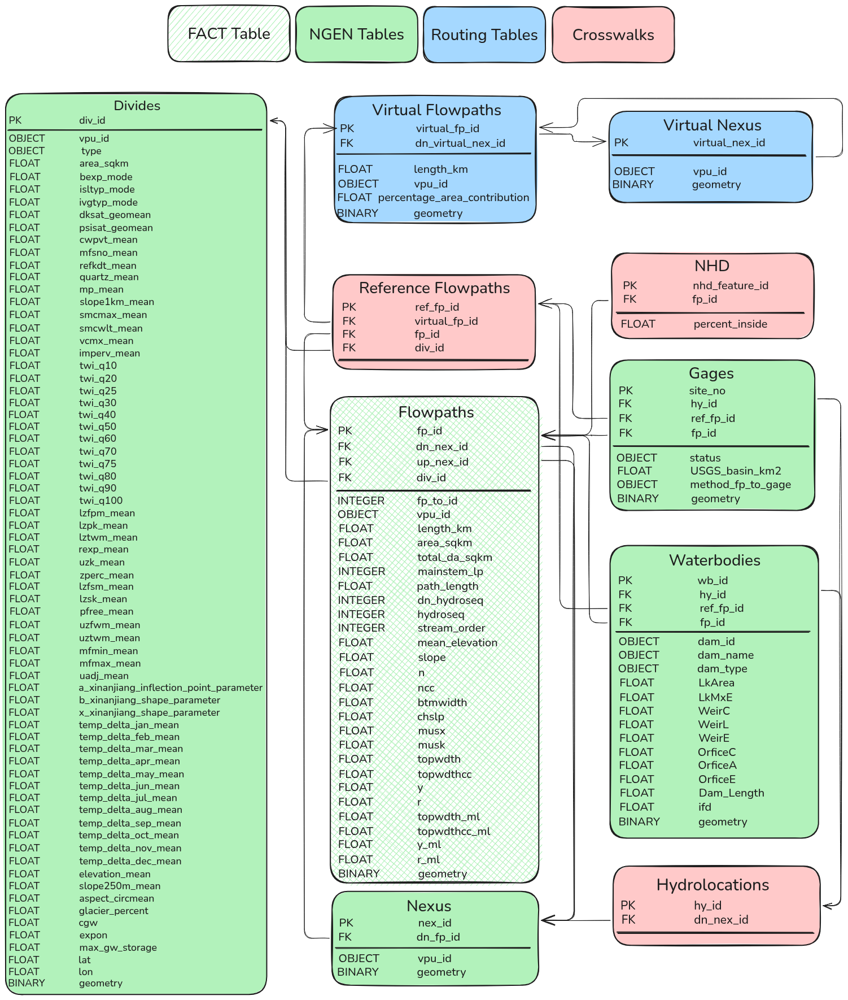
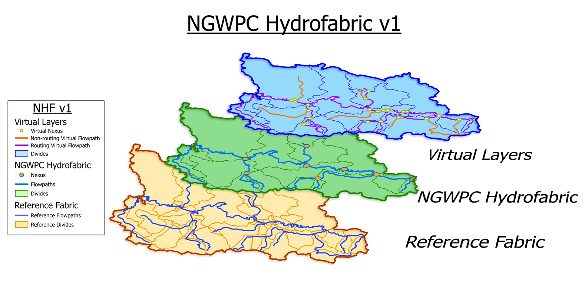

# hydrofabric-builds
Building Hydrofabric &amp; Processing Ancillary Data



### Getting Started
This repo is managed through [UV](https://docs.astral.sh/uv/getting-started/installation/) and can be installed through:
```sh
uv sync
```

### Quickstart
#### Automated Setup using [just](https://github.com/casey/just):
`just` calls series of commands called "recipes" similar to a `make` file. Install on linux with `apt get just` or follow linked readme for other platforms. After installing `just`, you can use the following commands to set up the data sources for `nhf-builds`. You can also use `just` to build hydrofabrics for each domain or specify a config.

**Note**: `just sync` commands will overwrite all input datasets in your `data` folder.

**Note**: `just build` commands will build `configs/example_[domain]_config.yaml`

Place AWS credentials in .env or manually set the relevant environment variables (AWS_DEFAULT_REGION, AWS_ACCESS_KEY_ID, etc.) then run the commands corresponding to your chosen domain:
```sh
# (1) download data from AWS
just sync       # CONUS
just sync-ak    # oCONUS/Alaska
just sync-hi    # oCONUS/Hawaii
just sync-prvi  # oCONUS/Puerto Rico & US Virgin Islands
just oconus-version=<version> sync-<domain> # Specify a reference fabric version for OCONUS
# (2) build hydrofabric
just build-conus # CONUS
just build-ak    # oCONUS/Alaska
just build-hi    # oCONUS/Hawaii
just build-prvi  # oCONUS/Puerto Rico & US Virgin Islands
just build "configs/my_custom_config.yaml" # Build a custom HydroFabric
```

#### Manual Setup:
[See here for all steps for downloading data from the RTX EDFS Test Account Bucket and running with uv run](docs/builds/quickstart.md)

### Development
To ensure that hydrofabric-builds follows the specified structure, be sure to install the local dev dependencies and run `uv run pre-commit install`

### Documentation
To build the user guide documentation for Icefabric locally, run the following commands:
```sh
uv sync --extra docs
uv run mkdocs serve -a localhost:8080
```
Docs will be spun up at localhost:8080/

Additional documentation can be found below for:
- [Divide Attributes](docs/builds/divide_attributes.md)
- [Flowpath Attributes](docs/builds/flowpath_attributes.md.md)
- [POI/Gages](docs/builds/POI_gages_builder.md)
- [Reservoir Attrubutes](docs/builds/reservoir_attrs.md)
- [Gage Locations](docs/builds/snap_gages_to_flowpaths.md)

#### Proposed Schema

The following schema is the proposed data model for NGWPC hydrofabric datasets produced by this repo.



##### Flowpaths FACT Table

The central table (or FACT Table) is `Flowpaths`. Each `flowpath` has a downstream, and upstream `nexus` point, allowing for traversal of a river network through a single table. Additionally, there is a 1:1 relationship between `flowpath` and `divide`.

##### NGEN Tables

The tables highlighted in green are the infomation needed for lumped modeling to take place. Lumped models require attributes, the shape of the `divide` that is being modeled, and a `nexus` point for flow to be aggregated to.

##### Routing Tables

The tables highlighted in blue contain the information needed for routing at a high resolution. T-Route is expected to run at a fine-scale (~300m segments) with many `virtual_flowpaths`. Each virtual flowpath is delineated based on the reference fabric, and there should be a many -> one relationship between `virtual_flowpaths` and `flowpaths`, with some `virtual flowpaths` not being represented in the `flowpaths` table. These non-represented `flowpaths` have the parameter of `routing_segment` set to False, and will have flow estimated through flow-scaling.

##### Reference Crosswalks

The NGWPC Hydrofabric is build using many reference materials:
- Reference Flowpaths
- Reference Reservoirs
- USGS/ENVCA/CADWR/TXDOT Streamflow Gages
- NHD+

To ensure `flowpaths` can be mapped to back to the materials that created them, each of the reference materials is mapped to `flowpaths`, `hydrolocations`, and `virtual flowpaths`. The following IDs pairings are used:

- Reference Flowpaths -> `ref_fp_id`
- Reference Reservoirs -> `dam_id`
- USGS/ENVCA/CADWR/TXDOT Streamflow Gages -> `site_no`
- NHD+ -> `nhd_feature_id`

##### Visual Diagram

